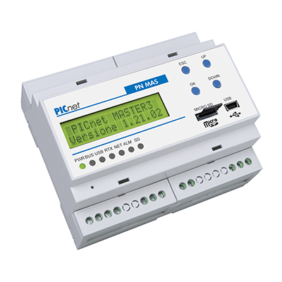
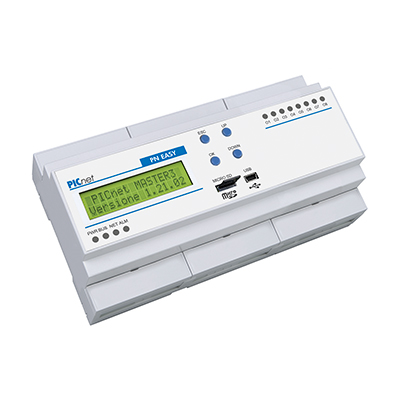
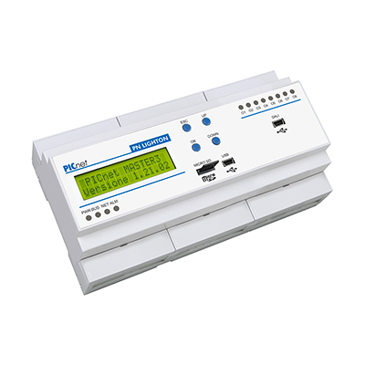

# Picnet Binding

_The picnet binding  can be used to interact with the Sinthesi picnet home automation enviroment._
_The binding allows the user to connect to a PN MAS device (version 7 and up recommended, for previus model a PN TCP/IP module may be required) and, along with the program on the PN MAS itself allows the user to freely control all aspects of their home automation systems._

## Supported Things

_This binding supports all of Sinthesi control units (PN MAS, PN EASY, PN LIGHTON and PN REC) that have an onboard ethernet port or that are connected to your local network via a PN TCP/IP module_

## Thing Configuration

_The thing has the following parameters_

|Name           |Type  |Description                                                                                         |Accepted value                                                             |
|---------------|------|----------------------------------------------------------------------------------------------------|---------------------------------------------------------------------------|
|Ip             |String|The ip address of the desired control unit                                                          |Any well formed ip address or host name (only supported by version 8 and up|
|Port           |String|The port used to communicate, usually 7001 or 4001 for PN TCP/IP devices                            |Any usable port number                                                     |
|pollingInterval|Int   |The interval in which the control unit is polled in milliseconds for new statuses, default is 100 ms|Any integer value                                                          |

## Channels

_In this binding there are no pre-defined channel, and it's up to the user to define the used channels._
_Each item must have a defined channel with the following syntax_

| item          | definition                                        |
|---------------|---------------------------------------------------|
| Switch        | Type#AddrBBit-trgAddr-trgBit-onValue-offValue-SW  |
| Contact       | Type#AddrBBit-CT                                  |
| Number        | Type#Addr-NB                                      |
| Rollershutter | Type#AddrBBit-upAddr-upBit-downAddr-downBit-RS    |
| Dimmer        | Type#Addr-DM                                      |

###Switch 
_Type: The address type whic can be Output (O) and Input (I) for modules and Virtual (V) for virtual variables_
_Addr: The address of the module for Input (I) or Output (O) or the address of the virtual variable (V), this value must be between 1 and 254 for Input and Output and between 1 and 2500 for Virtual variables_
_Bit: The bit for the ON/OFF state, both input output abd virtual have 16 bit for ON/OFF states_
_trgAddr: The address of the virtal variable that triggers the switch_
_trgBit: The bit of the virtual variable that triggers the switch_
_onValue: The value sent after an on command_
_offValue: The value sent after an off command_
_SW: item identifier for the switch_

_Note: For now the only value supported for the switch onValue and offValue is 1, it's suggested that the trigger variable gets set by the binding and then is set back to 0_ 
_by the control unit with a dedicated macro (shown below)_

###Contact
_Type: The address type whic can be Output (O) and Input (I) for modules and Virtual (V) for virtual variables_
_Addr: The address of the module for Input (I) or Output (O) or the address of the virtual variable (V), this value must be between 1 and 254 for Input and Output and between 1 and 2500 for Virtual variables_
_Bit: The bit for the ON/OFF state, both input output abd virtual have 16 bit for ON/OFF states_
_CT: item identifier for the contact_

###Number
_Type: The address type whic can be Output (O) and Input (I) for modules and Virtual (V) for virtual variables_
_Addr: The address of the module for Input (I) or Output (O) or the address of the virtual variable (V), this value must be between 1 and 254 for Input and Output and between 1 and 2500 for Virtual variables_
_NB: item identifier for the number_

###Rollershutter
_Type: The address type whic can be Output (O) and Input (I) for modules and Virtual (V) for virtual variables_
_Addr: The address of the module for Input (I) or Output (O) or the address of the virtual variable (V), this value must be between 1 and 254 for Input and Output and between 1 and 2500 for Virtual variables_
_upAddr: The address of the variables that moves the roller shutter up_
_upBit: The bit of the variable that moves the roller shutter up_
_downAddr: The address of the variables that moves the roller shutter down_
_downBit: The bit of the variable that moves the roller shutter down_
_RS: item identifier for the rollershutter_

###Dimmer
_Type: The address type whic can be Output (O) and Input (I) for modules and Virtual (V) for virtual variables_
_Addr: The address of the module for Input (I) or Output (O) or the address of the virtual variable (V), this value must be between 1 and 254 for Input and Output and between 1 and 2500 for Virtual variables_
_DM: item identifier for the rollershutter_

## Full Example

_Provide a full usage example based on textual configuration files (*.things, *.items, *.sitemap)._

## Any custom content here!

_Feel free to add additional sections for whatever you think should also be mentioned about your binding!_
